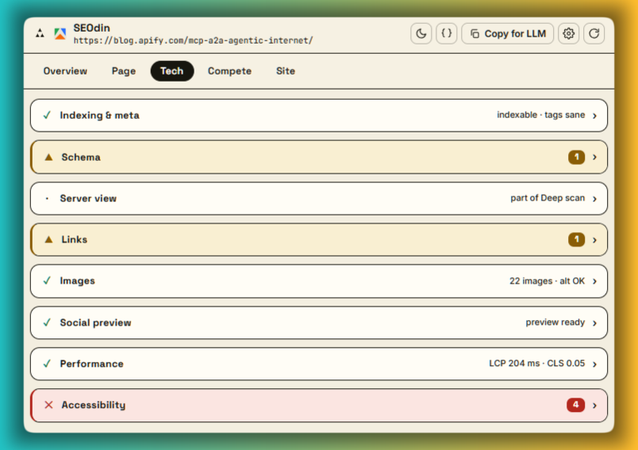
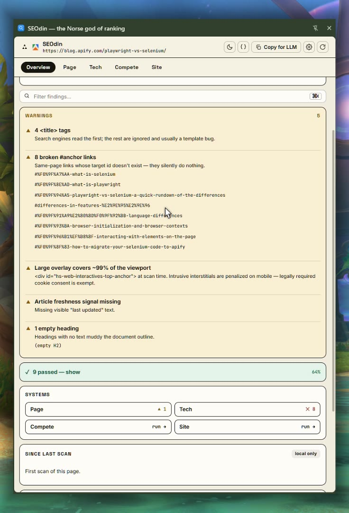
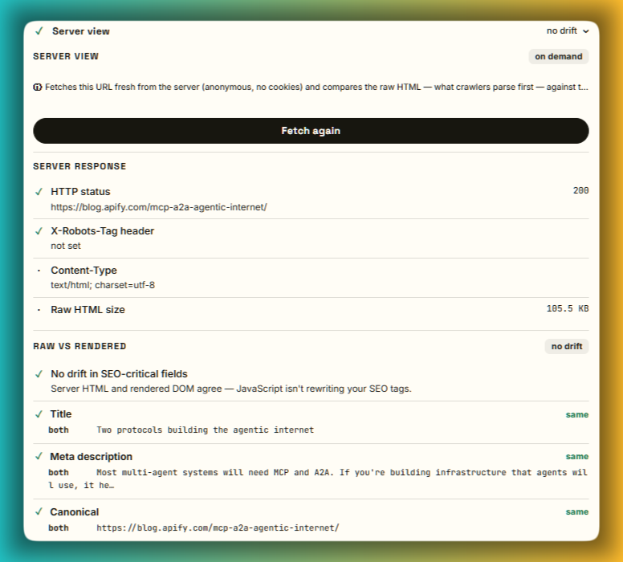
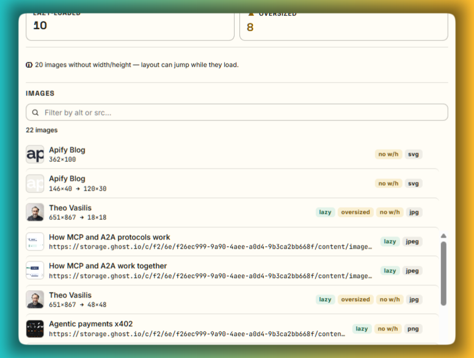
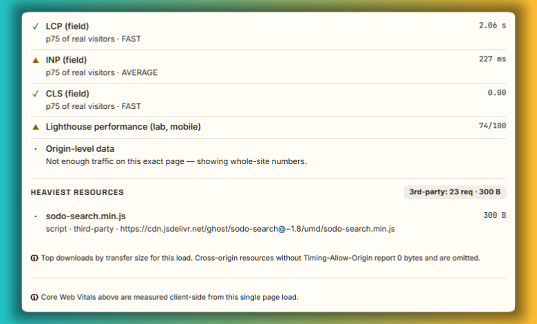
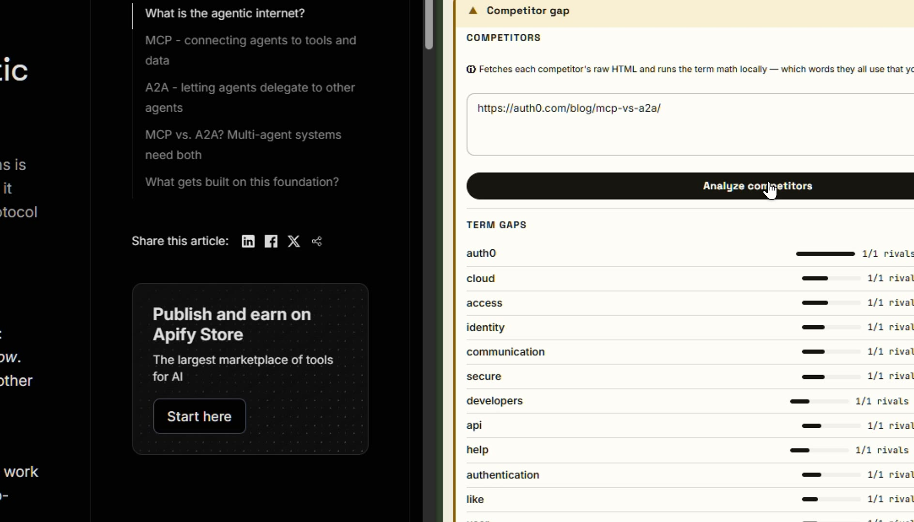
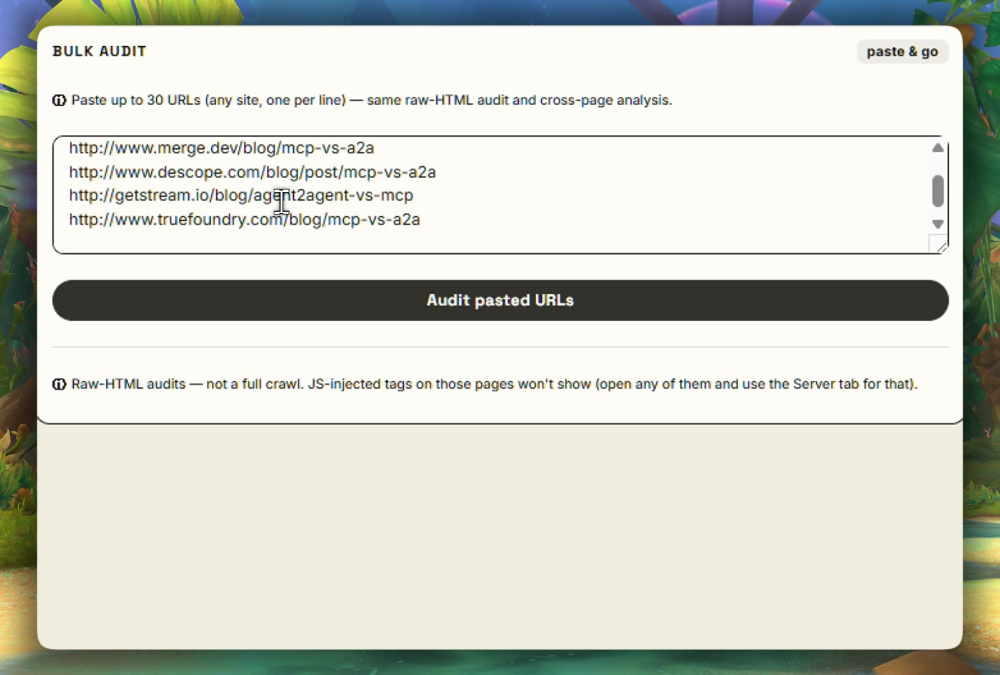
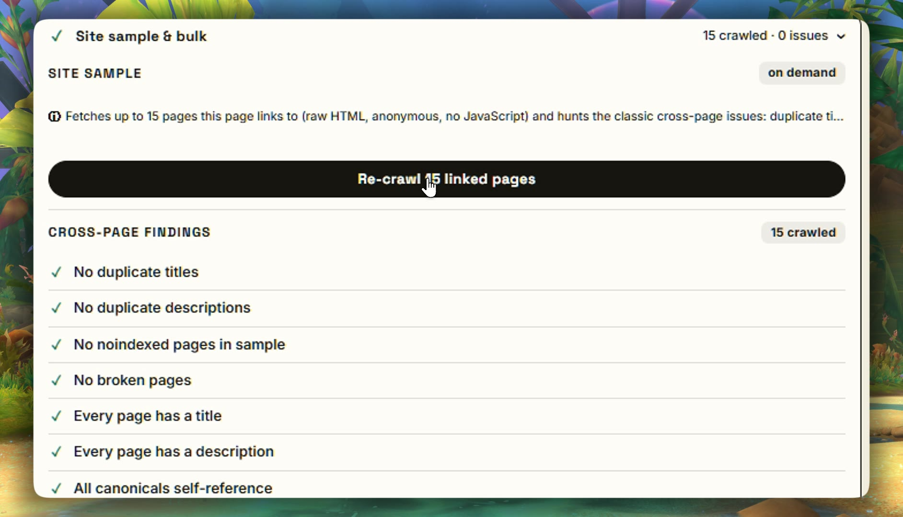

# SEOdin - the Norse god of ranking

One-click, on-page SEO audits in a Chrome side panel. No private indexes, no black-box scores, no paid APIs - just plain, checkable math on what the page actually serves. It would rather show you one true thing than a hundred faked ones.

Built by an SEO who got tired of paying a thousand a month for tools that do less and lie more. The full build story is at [reljabojovic.com/seodin](https://reljabojovic.com/seodin).

**100% local. Zero accounts. Zero telemetry. Zero paid APIs.** Every network request the extension can make is user-initiated, listed below, and goes only to the site you're auditing.

*Click through for the demo. Odin might be a myth, but SEO audits shouldn't be.*

## What you won't find anywhere else

- ⏳ **A Time machine** - pulls the Internet Archive's first-ever capture of the page you're auditing, right in the panel
- 🤖 **An LLM readability score** - how cleanly an AI can parse and cite your page (the closest thing anywhere is a Lighthouse category Google added in May 2026, and it checks plumbing, not content)
- 🚦 **A robots.txt tester that answers the real question** - is THIS page blocked, and by exactly which line
- 🧩 **A schema linter** that catches impossible dates, out-of-range ratings and broken breadcrumb chains - with paste-ready fixes. Everyone else links you out to Google's validator
- 📊 **A competitor term-gap analysis computed locally** - the paid tools charge credits for this
- 🕸️ **A site sample + bulk audit of 30 URLs**, free, inside the extension - everywhere else that's the paid platform upsell
- 🧠 **On-device AI** (Chrome's built-in model) - AI analysis with no API key and no cloud

## Why

Most SEO tools run on private indexes, proprietary algorithms, formulas you never get to see. All you're shown is a scale between two numbers, forcing you to abide by someone's index to amass good boy points on a dashboard. Any SEO who knows their chops ends up comparing providers and their numbers all day - more tabs, more consoles shrinking the viewport, more Screaming Frog for every little thing.

You don't need their private indexes at all. You read what the page itself serves and what the CDN serves, and you lean on what's genuinely public and free: the Internet Archive, the browser's own performance data, the schema on the page. That's enough to actually help an SEO - without ballooning into the bloated, stitched-together mess this was built to get away from.

## What it does

Everything lives in **five destinations**. Sections inside them are collapsible - all collapsed by default, with problems flagged right on the section header (a severity wash, a colored left bar and an issue count) so you can scan without expanding.

*Every section flags its own problems in yellow and red, so what's broken is obvious at a glance.*

### Overview

One verdict - Critical / Warnings / Passed - covering the issues that actually sink pages: noindex (meta *and* googlebot variant), missing title/description, conflicting or off-page canonicals, duplicate singleton tags, mixed content, missing alt text, title truncation, and more. Plus a transparent score, a one-click **Deep scan** that runs every engine at once, a **Time machine** that checks the Internet Archive's first and latest capture of the URL, and a "since last scan" diff from local history.

*Open the panel and the Overview leads with the score, followed by the most important warnings.*

### Page

| Section | What you get |
|---------|--------------|
| **Content & keywords** | Flesch reading ease (honestly skipped on non-English pages), word/sentence stats, top terms with Unicode-aware tokenization, and target-keyword coverage (title, H1, first paragraph, body, density). |
| **LLM readability** | A transparent, locally computed estimate of how cleanly an LLM can parse and cite the page (schema cleanliness, answer extractability, content-to-chrome ratio). |
| **Headings** | Counts, single-H1 check, skipped levels, empty headings, and a click-to-highlight outline. |
| **E-E-A-T signals** | Author, dates, publisher, about/contact pages, authoritative citations - signal detection, honestly labelled as such. |

### Tech

| Section | What you get |
|---------|--------------|
| **Indexing & meta** | A pixel-true Google search preview (desktop + mobile, real canvas-measured truncation), title/description audit, indexing checks, an on-demand robots.txt tester that answers "is THIS page blocked, and by which line" and scans the sitemap for the URL, hreflang linting, and one-click external validators. |
| **Schema** | JSON-LD types, recommended-field completeness, and a linter that catches unresolved template placeholders, broken `@id` references, malformed blocks, impossible dates, out-of-range ratings, broken breadcrumb sequences, and plain-text authors - with paste-ready fix snippets where they can be generated honestly. |
| **Server view** | On demand: fetches the URL fresh and diffs the raw server HTML against the rendered DOM - title, description, canonical, robots, H1s, JSON-LD, OG tags - exposing what JavaScript adds, changes, or removes. Also reveals the `X-Robots-Tag` header and how much of the content exists before JS runs. |
| **Links** | Internal/external/nofollow breakdown, prose-vs-chrome region classification, empty and placeholder anchors, plus an on-demand internal link checker (real GET status codes). |
| **Images** | Alt coverage, lazy-loading, DPR-aware oversize detection, missing width/height (layout-shift risk), filename-as-alt detection, and per-image download weight from resource timing. |
| **Social preview** | Live link-preview unfurl, Open Graph and Twitter Card checks, relative-og:image detection. |
| **Performance** | Core Web Vitals for this load (LCP, CLS, FCP, TTFB), transfer size, heaviest resources, third-party share - plus an on-demand real-world pull from Google's free PageSpeed/CrUX endpoint (adds field LCP/INP/CLS and a Lighthouse lab score). |
| **Accessibility** | Quick automated checks (lang, landmarks, labels, accessible names, heading order, WCAG 2.5.8-aware tap targets) - explicitly *not* sold as a full WCAG audit. |

*Server view: a fresh server fetch, raw vs rendered side by side.*

*Every image on the page, flagged for dimensions, size, lazy-loading and missing alt text.*

*PageSpeed Insights: real-world load data, straight from Google's free endpoint. Google's anonymous quota is basically dead now, so you paste your own free key once - it stays on your machine. Still free, still local, no subscription.*

### Compete

| Section | What you get |
|---------|--------------|
| **SERP X-Ray** | On a Google results page, reads the live organic results so you can see the whole SERP at a glance. |
| **Competitor gap** | On demand: paste rival URLs and get a local TF-IDF term-gap analysis - the terms they cover that you don't. |

*A head-to-head competitor comparison, run entirely on public, free data.*

### Site

| Section | What you get |
|---------|--------------|
| **Site sample & bulk** | On demand: samples the internal pages this page links to (raw HTML) and finds duplicate titles, duplicate descriptions, missing tags, noindexed and broken pages across them - plus a bulk audit for a pasted list of URLs. |

*Paste up to 30 URLs and audit their raw HTML side by side.*

*Crawl up to 15 other pages on one site for a same-site picture. Ready for eavesdropping on the competition.*

Everything element-level is **click-to-highlight**: click a finding and the panel scrolls the live page to the element and flashes it.

### Export

- **Copy for LLM** - a structured Markdown audit with an instruction header, ready to paste into any AI assistant.
- **Client report (.html)** - a self-contained, print-to-PDF report for sending to clients.
- **Markdown (.md)** and **raw audit (.json)**.

## Where's the AI in the scores? There isn't one.

One rule: no model ever sets a score or a verdict in SEOdin. The numbers are plain, transparent math you can check. We're all sick of 17 sources of truth, and a black-box AI estimate would just be an 18th.

Where AI does earn its place, it's two optional buttons running Chrome's on-device Gemini Nano that draft a meta description and suggest keywords, clearly labeled as drafts. Remove them tomorrow and 99% of SEOdin works exactly the same.

## Install (developer mode)

1. Download or clone this repo.
2. Open `chrome://extensions`, enable **Developer mode**.
3. **Load unpacked** → select the folder.
4. Pin SEOdin and click its icon on any page - the side panel opens.

No build step. Vanilla JavaScript, zero dependencies.

## Privacy

- All analysis runs in your browser, on the page you're viewing.
- Scan history and settings live in local extension storage on your machine.
- Network requests happen **only when you press a button that says so**, and only to the audited site itself: the internal link checker, the Server view fetch, the robots.txt/sitemap check, and the Site sample crawl. All are anonymous (no cookies).
- The external-validator buttons simply open Google's public tools in a new tab.
- Nothing is ever sent to us. There is no "us" to send it to.

## Honesty policy

Every number says where it came from. Heuristics are labelled "heuristic". Single-load metrics are labelled "this load". Checks that can't be automated honestly (color contrast, keyboard operability) say so instead of pretending. When the FAQ rich result died in May 2026, the tool started saying that too. If SEOdin can't know something, it tells you - it never fills the gap with a confident guess.

## Architecture notes

- **MV3**, side-panel based; the scraper is a single self-contained function injected with `chrome.scripting.executeScript` that reads the rendered DOM.
- Data-driven destination registry - five destinations, each holding collapsible sections; a section is one `{ id, label, health, render }` entry, where `health(a)` drives the collapsed-header status and issue count.
- Pure compute functions (triage rules, linters, parsers) are separated from rendering and memoized per scan.
- The robots.txt matcher implements Google's documented semantics: longest match wins, `Allow` wins ties, `*` wildcards, `$` anchors.

## Roadmap

On-device AI grading via Chrome's built-in model, watchtower regression monitoring, annotated screenshots, link-graph visualization - all free, all local. The module split + unit-test suite is the next engineering milestone.

## License

[MIT](LICENSE)
